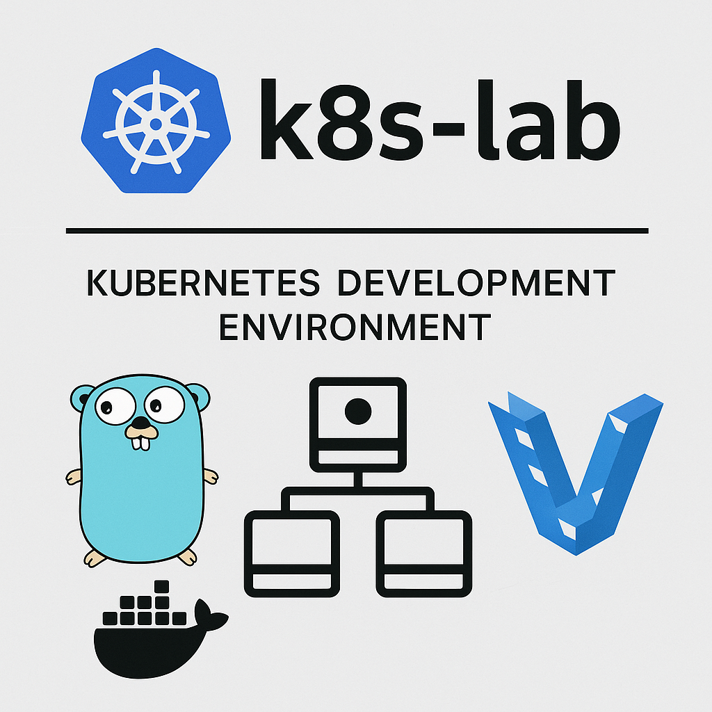

# k8s-lab



A not-so-lightweight-but-close-to-the-metal Kubernetes ⚓ development environment designed for learning, testing, and experimentation 👨‍💻.

k8s-lab sets up a local multi-node Kubernetes cluster using Vagrant and Cilium. Ideal for those who want to explore Kubernetes in a reproducible and isolated setup as close as bare metal as I can get.

## Requirements

- [golang](https://golang.org)
- [docker](https://docker.com)
- [kubectl](https://kubernetes.io)
- [helm](https://helm.sh)
- [vagrant](https://vagrantup.com)
- [VMWare Workstation/Fusion](https://www.vmware.com/products/desktop-hypervisor/workstation-and-fusion)

# ⚓ Set up the k8s cluster

First, let's create a configuration file

```sh
cp config.example.yaml config.yaml
```

Secondly, start with creating the cluster from scratch 🔨

```sh
vagrant up # Create and set up k8s cluster from scratch
```

The latter will create the following (see: `Vagrantfile`):

- a control plane guest VM
  - CNI plugin of choice: [cilium](https://docs.cilium.io)
  - an `k8s-lab-admin` user set of credentials, which will be available at `files/local/k8s/users`
- a number of worker nodes (see `k8s_number_work_nodes`)
- OS of choice: Ubuntu Server 24.04
  - An `.env` file has been provided that sets `KUBECONFIG` to these credentials
    - This project configures [vs-kubernetes](https://marketplace.visualstudio.com/items?itemName=ms-kubernetes-tools.vscode-kubernetes-tools) extension to use the cluster right out of the gate with the `k8s-lab-admin` user

After all machines have been provisioned, you're welcome to double check whether cilium is doing fine on the control plane guest:

```sh
> vagrant ssh cp # SSH into the control plane guest
$ cilium status --wait
$ cilium connectivity test
```

Once all is good, you will still need to install the ingress controller of choice -> [ingress-nginx](https://github.com/kubernetes/ingress-nginx) and load balancer of choice -> [metallb]() in order to expose all services running in the k8s cluster. There's a ready-to-go script in the control plane host:

```sh
> vagrant ssh cp
$ k8s-install-ingress-controller # This will install and configure both ingress-nginx and metallb
```

## Set up your local Docker client🚢

The cluster's control-plane host will also run a vanilla docker registry, with no TLS. Therefore it's necessary to configure your docker client to allow plain HTTP communication with the docker registry, this is done in the `/etc/docker/daemon.json` like so:

```json
{
  "insecure-registries": ["<k8s_cplane_addr>:5000"]
}
```

## Access the _load balancer_

`metallb` will be listening on the IP address set by the `k8s_load_balancer_ip` setting in `config.yaml`. For example, if you set it to `192.168.64.1`, you could simply:

```sh
nc -zv 192.168.64.1 80 # test connection
curl -v http://192.168.64.1 # an actual request to the load balancer
```

## Deploy all the things!

Now we're ready to deploy it all into the cluster! yay!. This can be acomplished by running the `deploy.py` script at the root level directory:

```sh
python deploy.py
```

The latter will:

- Build all docker images from all `apps/`
- Apply any manifests in the `k8s/manifests` directory
  - Among these, we have the main `Ingress` that will be sitting behind the `ingress-nginx` controller and exposed by `metallb`
- Install/update any [Helm](helm.sh) charts located in the `k8s/charts` directory.

## (Optional) Install and access the _Kubernetes Dashboard_

Additionally, you can install the [kubernetes dashboard](https://github.com/kubernetes/dashboard), by executing the `k8s-install-dashboard` utility in the control plane host:

```sh
vagrant ssh cp
k8s-install-dashboard
```

At this point you can access by the means provided in the project's [documentation](https://github.com/kubernetes/dashboard/blob/master/docs/user/accessing-dashboard/README.md)

## Copyright and Licensing

Copyright (c) 2021 Alejandro Ricoveri

Permission is hereby granted, free of charge, to any person obtaining a copy
of this software and associated documentation files (the "Software"), to deal
in the Software without restriction, including without limitation the rights
to use, copy, modify, merge, publish, distribute, sublicense, and/or sell
copies of the Software, and to permit persons to whom the Software is
furnished to do so, subject to the following conditions:

The above copyright notice and this permission notice shall be included in
all copies or substantial portions of the Software.

THE SOFTWARE IS PROVIDED "AS IS", WITHOUT WARRANTY OF ANY KIND, EXPRESS OR
IMPLIED, INCLUDING BUT NOT LIMITED TO THE WARRANTIES OF MERCHANTABILITY,
FITNESS FOR A PARTICULAR PURPOSE AND NONINFRINGEMENT. IN NO EVENT SHALL THE
AUTHORS OR COPYRIGHT HOLDERS BE LIABLE FOR ANY CLAIM, DAMAGES OR OTHER
LIABILITY, WHETHER IN AN ACTION OF CONTRACT, TORT OR OTHERWISE, ARISING FROM,
OUT OF OR IN CONNECTION WITH THE SOFTWARE OR THE USE OR OTHER DEALINGS IN
THE SOFTWARE.
